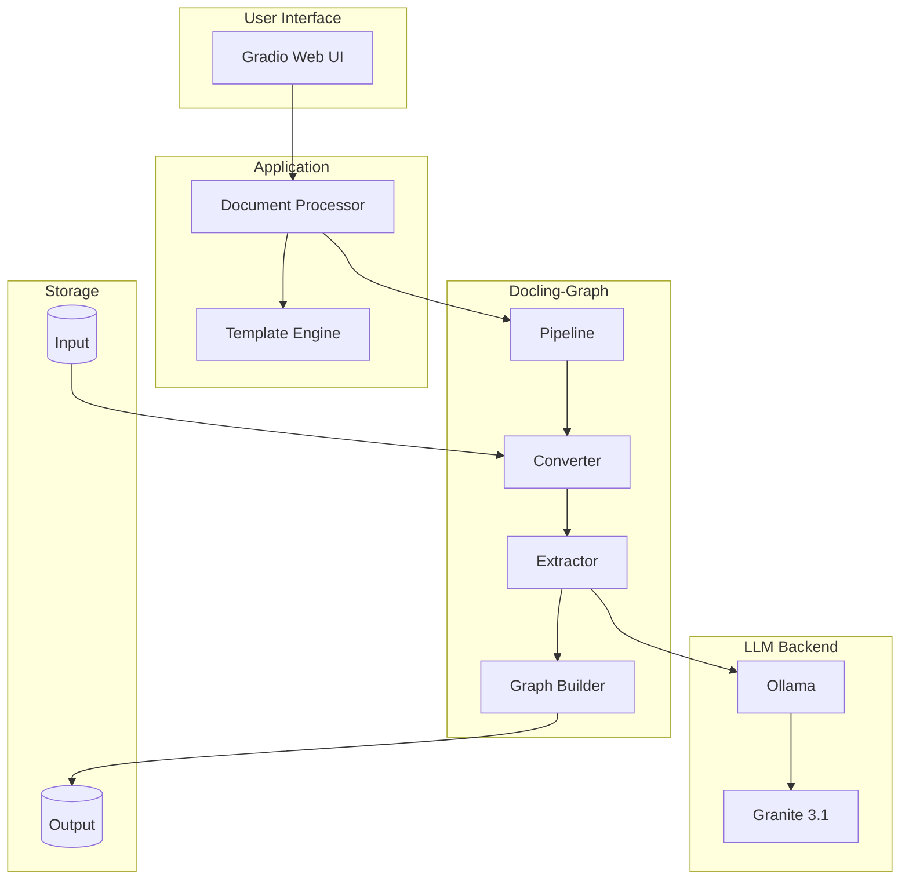
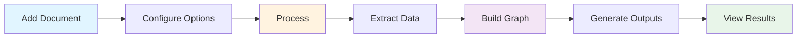

# Docling-Graph Showcase Application

<div align="center">


**Transform documents into validated knowledge graphs using docling-graph with local Ollama/Granite4 LLM**

[](https://www.python.org/downloads/)
[](https://gradio.app/)
[](https://ollama.com/)
[](LICENSE)

[Features](#features) • [Quick Start](#quick-start) • [Documentation](#documentation) • [Architecture](#architecture) • [Contributing](#contributing)

</div>

---

## 📋 Overview

The Docling-Graph Showcase Application is a production-ready web interface for processing documents using the [docling-graph](https://github.com/docling-project/docling-graph) library. It provides an intuitive Gradio-based UI for extracting structured data from documents and building knowledge graphs with local LLM inference via Ollama.

### Key Features

- 🎯 **Intuitive Web UI** - User-friendly Gradio interface for document processing
- 📄 **Multiple Formats** - Support for PDF, images, markdown, Office documents, and more
- 🔄 **Batch Processing** - Process multiple documents simultaneously
- 🧠 **Local LLM** - Privacy-focused local inference with Ollama and Granite models
- 📊 **Interactive Graphs** - Visualize knowledge graphs with interactive HTML
- 💾 **Multiple Exports** - CSV, Cypher, and other knowledge graph formats
- 🐳 **Container Ready** - Docker and Kubernetes deployment support
- 🚀 **Production Ready** - Automated scripts, monitoring, and scaling

## 🎯 Use Cases

- **Research Papers** - Extract entities, relationships, and findings
- **Legal Documents** - Identify parties, clauses, and obligations
- **Technical Manuals** - Map procedures, components, and dependencies
- **Business Reports** - Extract metrics, trends, and insights
- **Medical Records** - Structure patient data, diagnoses, and treatments

## 🚀 Quick Start

### Prerequisites

- Python 3.10 or higher
- 8GB RAM minimum (16GB recommended)
- 10GB free disk space
- Linux, macOS, or Windows (with WSL)

### Installation

```bash
# 1. Clone the repository
git clone <repository-url>
cd docling-graph-showcase

# 2. Install Ollama
curl -fsSL https://ollama.com/install.sh | sh

# 3. Pull Granite4 model
ollama pull granite4

# 4. Launch application
./scripts/launch.sh
```

The application will be available at **http://localhost:7860**

### First Document

1. Place a document in the `./input` directory
2. Open http://localhost:7860 in your browser
3. Select your document from the dropdown
4. Click "🚀 Process Document"
5. View results in the `./output` directory

## 📚 Documentation

Comprehensive documentation is available in the `Docs/` directory:

- **[User Guide](Docs/user-guide.md)** - Complete usage instructions
- **[Architecture](Docs/architecture.md)** - System design and components
- **[Deployment Guide](Docs/deployment-guide.md)** - Production deployment

## 🏗️ Architecture



## 📁 Project Structure

```
docling-graph-showcase/
├── app.py                      # Main Gradio application
├── requirements.txt            # Python dependencies
├── Dockerfile                  # Container image definition
├── README.md                   # This file
│
├── _samples/                   # Sample templates (excluded from git)
│   └── simple_template.py      # Basic document template
│
├── input/                      # Input documents directory
├── output/                     # Processed results directory
│
├── scripts/                    # Automation scripts
│   ├── launch.sh              # Start application
│   ├── stop.sh                # Stop application
│   └── git-push.sh            # Git push (excludes _ folders)
│
├── Docs/                       # Documentation
│   ├── architecture.md        # System architecture
│   ├── user-guide.md          # User documentation
│   └── deployment-guide.md    # Deployment instructions
│
└── k8s/                        # Kubernetes manifests
    ├── deployment.yaml        # Application deployment
    ├── service.yaml           # Service definition
    ├── pvc.yaml               # Persistent volume claims
    ├── configmap.yaml         # Configuration
    └── secret-template.yaml   # Secrets template
```

## 🎨 Features

### Individual Processing

Process single documents with full control over extraction parameters:

- **Backend Selection** - Choose between LLM (text) or VLM (vision)
- **Processing Modes** - One-to-one or many-to-one
- **Chunking** - Automatic splitting for large documents
- **Provider Options** - Ollama (local) or remote APIs

### Batch Processing

Process multiple documents simultaneously:

- Automatic file discovery
- Progress tracking
- Consolidated results
- Error handling per file

### Output Formats

Generated outputs for each processed document:

- **summary_TIMESTAMP.md** - Processing summary and metadata
- **graph.html** - Interactive knowledge graph visualization
- **nodes.csv** - Extracted entities
- **edges.csv** - Relationships between entities
- **document.md** - Markdown version of source

## 🛠️ Configuration

### Environment Variables

Create a `.env` file:

```bash
# Ollama Configuration
OLLAMA_BASE_URL=http://localhost:11434
OLLAMA_MODEL=granite3.1:8b

# Optional: Remote API Keys
MISTRAL_API_KEY=your_key_here
OPENAI_API_KEY=your_key_here
GEMINI_API_KEY=your_key_here

# Application Settings
GRADIO_SERVER_PORT=7860
GRADIO_SERVER_NAME=0.0.0.0
```

### Custom Templates

Create domain-specific extraction templates in `_samples/`:

```python
from pydantic import BaseModel, Field
from typing import List

def edge(label: str, **kwargs):
    return Field(..., json_schema_extra={"edge_label": label}, **kwargs)

class CustomDocument(BaseModel):
    """Your custom template"""
    model_config = {'is_entity': True}
    
    title: str = Field(description="Document title")
    entities: List[Entity] = edge("HAS_ENTITY")
```

## 🐳 Deployment

### Docker

```bash
# Build image
docker build -t docling-graph-app .

# Run container
docker run -d \
  -p 7860:7860 \
  -v $(pwd)/input:/app/input \
  -v $(pwd)/output:/app/output \
  docling-graph-app
```

### Docker Compose

```bash
# Start services
docker-compose up -d

# View logs
docker-compose logs -f

# Stop services
docker-compose down
```

### Kubernetes

```bash
# Deploy to cluster
kubectl apply -f k8s/

# Check status
kubectl get pods -l app=docling-graph

# Access service
kubectl get service docling-graph-service
```

See [Deployment Guide](Docs/deployment-guide.md) for detailed instructions.

## 🔧 Scripts

### Launch Application

```bash
./scripts/launch.sh
```

Automatically:
- Creates virtual environment
- Installs dependencies
- Checks Ollama installation
- Pulls required models
- Starts application in detached mode

### Stop Application

```bash
./scripts/stop.sh
```

Gracefully stops the running application.

### Git Push (Excludes _ folders)

```bash
./scripts/git-push.sh
```

Commits and pushes changes while excluding folders starting with underscore.

## 📊 Example Workflow



1. **Add Document** - Place file in `./input/`
2. **Configure** - Select backend, mode, and model
3. **Process** - Click process button
4. **Extract** - LLM extracts structured data
5. **Build Graph** - Construct knowledge graph
6. **Generate** - Create output files
7. **View** - Explore results

## 🔍 Supported Document Types

| Format | Extension | Backend | Notes |
|--------|-----------|---------|-------|
| PDF | .pdf | LLM/VLM | Multi-page support |
| Images | .png, .jpg, .jpeg | VLM | Forms, diagrams |
| Markdown | .md | LLM | Structured text |
| Office | .docx, .pptx, .xlsx | LLM | Microsoft Office |
| HTML | .html | LLM | Web pages |
| Text | .txt | LLM | Plain text |

## 🎓 Learning Resources

- **[Docling-Graph Documentation](https://docling-project.github.io/docling-graph/)** - Official docs
- **[Ollama Documentation](https://ollama.com/docs)** - LLM setup
- **[Gradio Documentation](https://gradio.app/docs)** - UI framework
- **[Pydantic Documentation](https://docs.pydantic.dev/)** - Schema validation

## 🤝 Contributing

Contributions are welcome! Please:

1. Fork the repository
2. Create a feature branch
3. Make your changes
4. Submit a pull request

## 📝 License

This project is licensed under the MIT License - see the [LICENSE](LICENSE) file for details.

## 🙏 Acknowledgments

Built with outstanding open-source projects:

- [Docling-Graph](https://github.com/docling-project/docling-graph) - Document to graph transformation
- [Gradio](https://gradio.app/) - Web UI framework
- [Ollama](https://ollama.com/) - Local LLM inference
- [Pydantic](https://pydantic.dev/) - Data validation
- [NetworkX](https://networkx.org/) - Graph operations

## 📞 Support

- **Documentation**: See `Docs/` directory
- **Issues**: Open an issue on GitHub
- **Discussions**: GitHub Discussions

## 🗺️ Roadmap

- [ ] Advanced template builder UI
- [ ] Real-time collaboration
- [ ] REST API
- [ ] Additional export formats
- [ ] Performance optimizations
- [ ] Multi-language support

---

<div align="center">

**Made with ❤️ using Docling-Graph**

[Documentation](Docs/) • [Architecture](Docs/architecture.md) • [Deployment](Docs/deployment-guide.md)

</div>