# Architecture Documentation

## System Overview

The Docling-Graph Showcase Application is a web-based interface for processing documents using the docling-graph library with local LLM inference via Ollama.

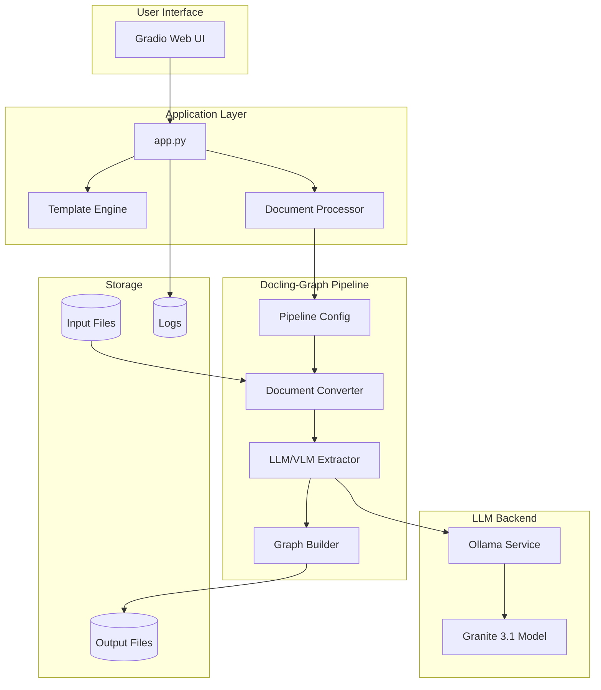

## Component Architecture

### 1. User Interface Layer

**Technology:** Gradio 4.x

**Components:**
- Individual Processing Tab
- Batch Processing Tab
- Help & Documentation Tab

**Features:**
- File selection from input directory
- Configuration options (backend, mode, chunking)
- Real-time progress tracking
- Result visualization

### 2. Application Layer

**Main Components:**

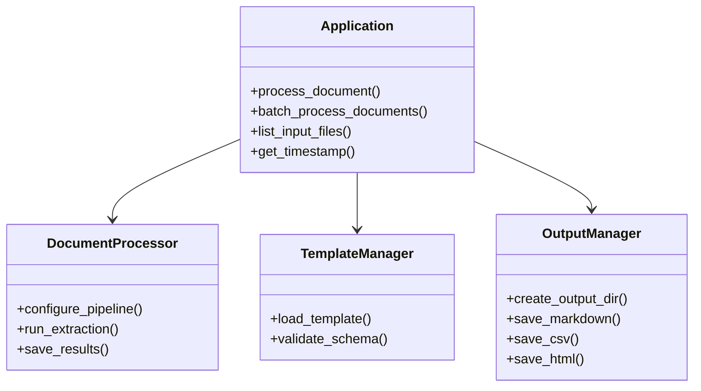

### 3. Docling-Graph Pipeline

**Pipeline Stages:**

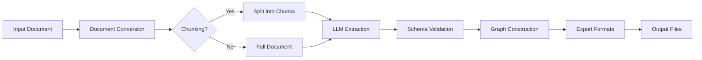

**Processing Modes:**

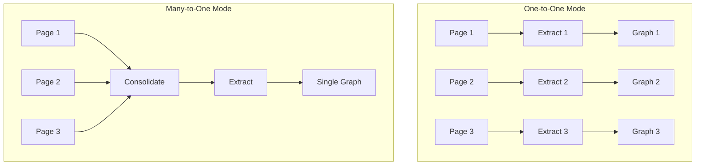

### 4. LLM Backend

**Ollama Integration:**

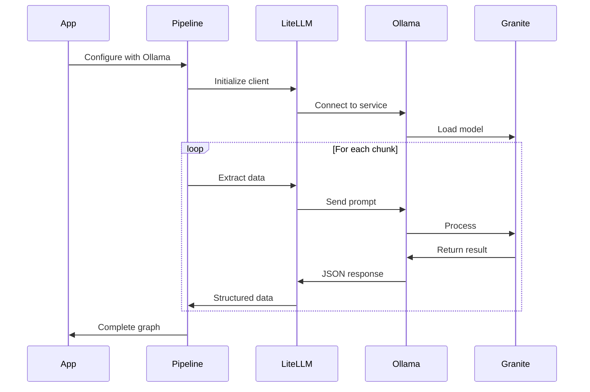

## Data Flow

### Individual Processing Flow

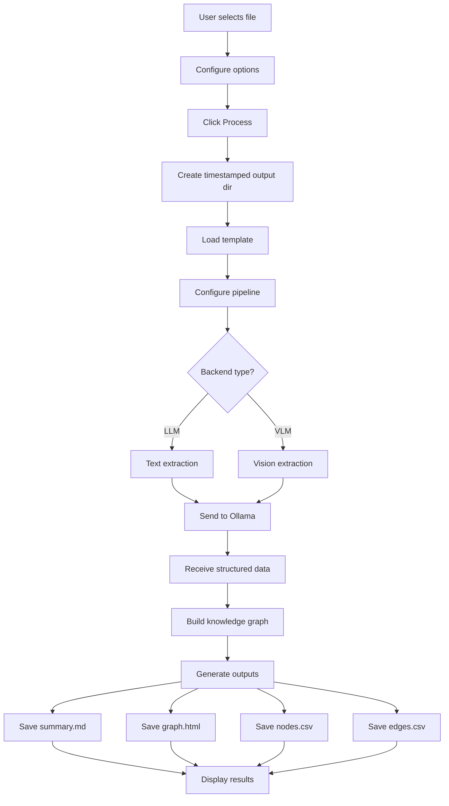

### Batch Processing Flow

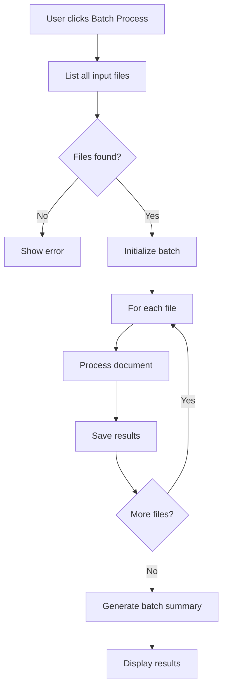

## Deployment Architecture

### Local Deployment

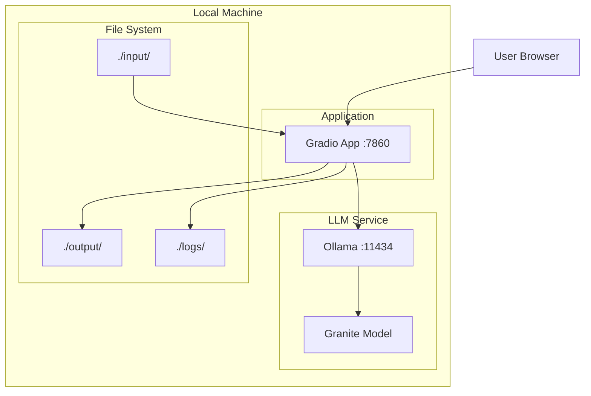

### Docker Deployment

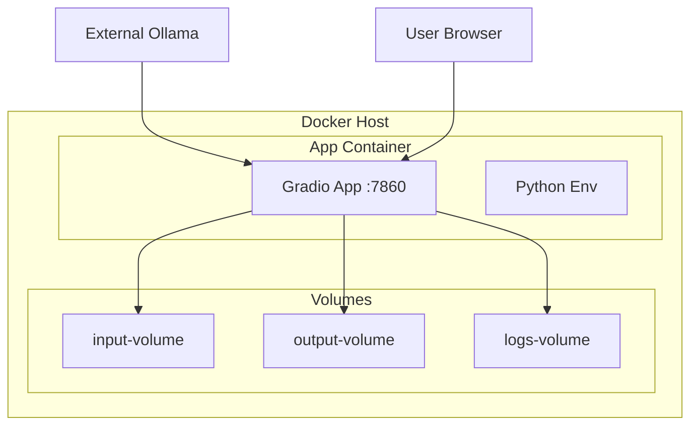

### Kubernetes Deployment

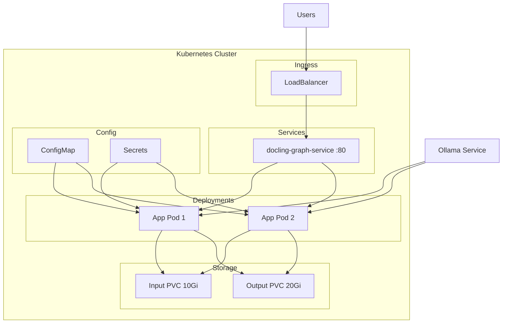

## Security Architecture

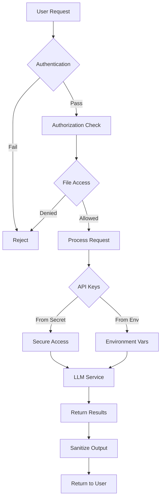

## Scalability Considerations

### Horizontal Scaling

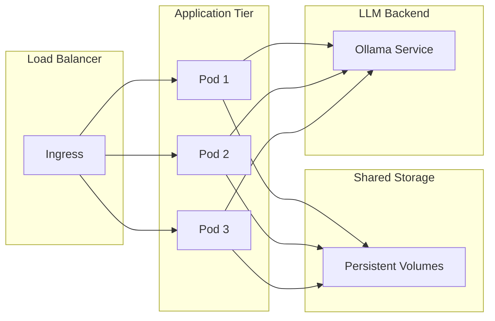

### Performance Optimization

1. **Caching Strategy**
   - Template caching
   - Model response caching
   - File metadata caching

2. **Async Processing**
   - Background job queue
   - Parallel chunk processing
   - Async file I/O

3. **Resource Management**
   - Connection pooling
   - Memory limits
   - CPU throttling

## Monitoring & Observability

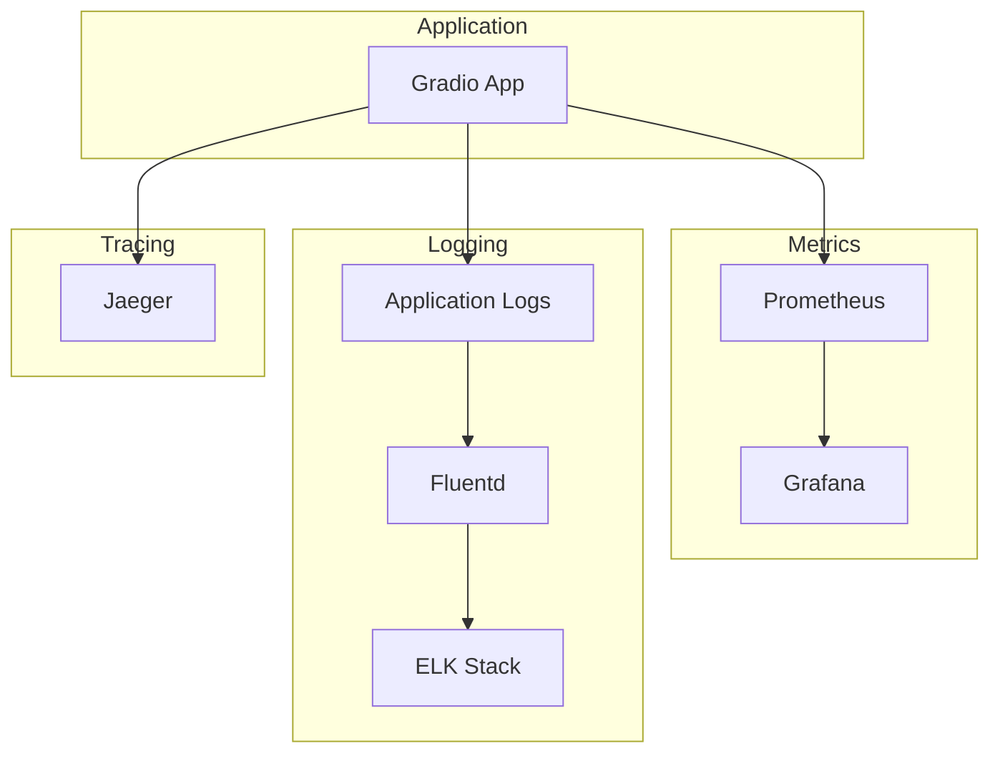

## Technology Stack

| Layer | Technology | Version | Purpose |
|-------|-----------|---------|---------|
| Frontend | Gradio | 4.x | Web UI |
| Backend | Python | 3.11 | Application logic |
| Framework | docling-graph | latest | Document processing |
| LLM | Ollama | latest | Local inference |
| Model | Granite 3.1 | 8B | Language model |
| Container | Docker | latest | Containerization |
| Orchestration | Kubernetes | 1.28+ | Container orchestration |
| Storage | PVC | - | Persistent storage |

## Design Patterns

### 1. Pipeline Pattern
- Sequential processing stages
- Each stage transforms data
- Error handling at each stage

### 2. Factory Pattern
- Template creation
- Pipeline configuration
- Output format generation

### 3. Strategy Pattern
- Backend selection (LLM/VLM)
- Processing mode selection
- Export format selection

### 4. Observer Pattern
- Progress tracking
- Status updates
- Event logging

## Future Enhancements

1. **Multi-tenancy Support**
   - User authentication
   - Workspace isolation
   - Resource quotas

2. **Advanced Features**
   - Custom template builder UI
   - Real-time collaboration
   - Version control for templates

3. **Integration**
   - REST API
   - Webhook support
   - External storage (S3, GCS)

4. **Performance**
   - GPU acceleration
   - Distributed processing
   - Advanced caching