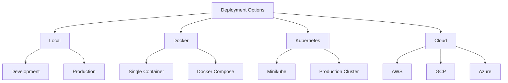

# Deployment Guide

## Overview

This guide covers deploying the Docling-Graph Showcase Application in various environments.

## Deployment Options



## Local Deployment

### Development Mode

Quick setup for development:

```bash
# Clone repository
git clone <repository-url>
cd docling-graph-showcase

# Launch application
./scripts/launch.sh

# Access at http://localhost:7860
```

### Production Mode

For production use on a single server:

```bash
# 1. Install system dependencies
sudo apt-get update
sudo apt-get install -y python3.11 python3-pip

# 2. Install Ollama
curl -fsSL https://ollama.com/install.sh | sh

# 3. Setup application
python3 -m venv venv
source venv/bin/activate
pip install -r requirements.txt

# 4. Configure systemd service
sudo tee /etc/systemd/system/docling-graph.service << EOF
[Unit]
Description=Docling-Graph Showcase Application
After=network.target

[Service]
Type=simple
User=$USER
WorkingDirectory=$(pwd)
Environment="PATH=$(pwd)/venv/bin"
ExecStart=$(pwd)/venv/bin/python app.py
Restart=always
RestartSec=10

[Install]
WantedBy=multi-user.target
EOF

# 5. Enable and start service
sudo systemctl daemon-reload
sudo systemctl enable docling-graph
sudo systemctl start docling-graph

# 6. Check status
sudo systemctl status docling-graph
```

### Nginx Reverse Proxy

```nginx
# /etc/nginx/sites-available/docling-graph
server {
    listen 80;
    server_name your-domain.com;

    location / {
        proxy_pass http://localhost:7860;
        proxy_http_version 1.1;
        proxy_set_header Upgrade $http_upgrade;
        proxy_set_header Connection "upgrade";
        proxy_set_header Host $host;
        proxy_set_header X-Real-IP $remote_addr;
        proxy_set_header X-Forwarded-For $proxy_add_x_forwarded_for;
        proxy_set_header X-Forwarded-Proto $scheme;
        
        # Increase timeouts for long-running requests
        proxy_connect_timeout 600s;
        proxy_send_timeout 600s;
        proxy_read_timeout 600s;
    }
}
```

Enable the site:

```bash
sudo ln -s /etc/nginx/sites-available/docling-graph /etc/nginx/sites-enabled/
sudo nginx -t
sudo systemctl reload nginx
```

## Docker Deployment

### Single Container

Build and run:

```bash
# Build image
docker build -t docling-graph-app:latest .

# Run container
docker run -d \
  --name docling-graph \
  -p 7860:7860 \
  -v $(pwd)/input:/app/input \
  -v $(pwd)/output:/app/output \
  -e OLLAMA_BASE_URL=http://host.docker.internal:11434 \
  --restart unless-stopped \
  docling-graph-app:latest

# View logs
docker logs -f docling-graph

# Stop container
docker stop docling-graph

# Remove container
docker rm docling-graph
```

### Docker Compose

Create `docker-compose.yml`:

```yaml
version: '3.8'

services:
  app:
    build: .
    image: docling-graph-app:latest
    container_name: docling-graph
    ports:
      - "7860:7860"
    environment:
      - OLLAMA_BASE_URL=http://ollama:11434
      - GRADIO_SERVER_NAME=0.0.0.0
      - GRADIO_SERVER_PORT=7860
    volumes:
      - ./input:/app/input
      - ./output:/app/output
      - ./logs:/app/logs
    depends_on:
      - ollama
    restart: unless-stopped
    networks:
      - docling-network

  ollama:
    image: ollama/ollama:latest
    container_name: ollama
    ports:
      - "11434:11434"
    volumes:
      - ollama-data:/root/.ollama
    restart: unless-stopped
    networks:
      - docling-network
    # For GPU support, uncomment:
    # deploy:
    #   resources:
    #     reservations:
    #       devices:
    #         - driver: nvidia
    #           count: 1
    #           capabilities: [gpu]

volumes:
  ollama-data:

networks:
  docling-network:
    driver: bridge
```

Deploy:

```bash
# Start services
docker-compose up -d

# Pull model in Ollama container
docker exec ollama ollama pull granite3.1:8b

# View logs
docker-compose logs -f

# Stop services
docker-compose down

# Stop and remove volumes
docker-compose down -v
```

### Docker with GPU Support

For NVIDIA GPU acceleration:

```bash
# Install NVIDIA Container Toolkit
distribution=$(. /etc/os-release;echo $ID$VERSION_ID)
curl -s -L https://nvidia.github.io/nvidia-docker/gpgkey | sudo apt-key add -
curl -s -L https://nvidia.github.io/nvidia-docker/$distribution/nvidia-docker.list | \
  sudo tee /etc/apt/sources.list.d/nvidia-docker.list

sudo apt-get update
sudo apt-get install -y nvidia-container-toolkit
sudo systemctl restart docker

# Run with GPU
docker run -d \
  --name docling-graph \
  --gpus all \
  -p 7860:7860 \
  -v $(pwd)/input:/app/input \
  -v $(pwd)/output:/app/output \
  docling-graph-app:latest
```

## Kubernetes Deployment

### Prerequisites

```bash
# Install kubectl
curl -LO "https://dl.k8s.io/release/$(curl -L -s https://dl.k8s.io/release/stable.txt)/bin/linux/amd64/kubectl"
sudo install -o root -g root -m 0755 kubectl /usr/local/bin/kubectl

# Verify installation
kubectl version --client
```

### Minikube (Local Testing)

```bash
# Install Minikube
curl -LO https://storage.googleapis.com/minikube/releases/latest/minikube-linux-amd64
sudo install minikube-linux-amd64 /usr/local/bin/minikube

# Start cluster
minikube start --cpus=4 --memory=8192

# Enable addons
minikube addons enable ingress
minikube addons enable metrics-server

# Build image in Minikube
eval $(minikube docker-env)
docker build -t docling-graph-app:latest .

# Deploy application
kubectl apply -f k8s/

# Get service URL
minikube service docling-graph-service --url

# Access dashboard
minikube dashboard
```

### Production Cluster

#### Step 1: Build and Push Image

```bash
# Build image
docker build -t your-registry/docling-graph-app:v1.0.0 .

# Push to registry
docker push your-registry/docling-graph-app:v1.0.0

# Update deployment.yaml with image
sed -i 's|docling-graph-app:latest|your-registry/docling-graph-app:v1.0.0|' k8s/deployment.yaml
```

#### Step 2: Create Namespace

```bash
# Create namespace
kubectl create namespace docling-graph

# Set as default
kubectl config set-context --current --namespace=docling-graph
```

#### Step 3: Configure Secrets

```bash
# Copy template
cp k8s/secret-template.yaml k8s/secret.yaml

# Edit with your API keys
nano k8s/secret.yaml

# Apply secret
kubectl apply -f k8s/secret.yaml

# Verify
kubectl get secrets
```

#### Step 4: Deploy Application

```bash
# Apply all manifests
kubectl apply -f k8s/pvc.yaml
kubectl apply -f k8s/configmap.yaml
kubectl apply -f k8s/deployment.yaml
kubectl apply -f k8s/service.yaml

# Check deployment
kubectl get all

# Watch pods
kubectl get pods -w

# Check logs
kubectl logs -f deployment/docling-graph-app
```

#### Step 5: Access Application

```bash
# Get service details
kubectl get service docling-graph-service

# For LoadBalancer
EXTERNAL_IP=$(kubectl get service docling-graph-service -o jsonpath='{.status.loadBalancer.ingress[0].ip}')
echo "Access at: http://$EXTERNAL_IP"

# For NodePort
NODE_PORT=$(kubectl get service docling-graph-service -o jsonpath='{.spec.ports[0].nodePort}')
NODE_IP=$(kubectl get nodes -o jsonpath='{.items[0].status.addresses[?(@.type=="ExternalIP")].address}')
echo "Access at: http://$NODE_IP:$NODE_PORT"

# Port forward (for testing)
kubectl port-forward service/docling-graph-service 7860:80
```

### Scaling

```bash
# Scale deployment
kubectl scale deployment docling-graph-app --replicas=3

# Autoscaling
kubectl autoscale deployment docling-graph-app \
  --min=2 \
  --max=10 \
  --cpu-percent=80

# Check HPA
kubectl get hpa
```

### Updates

```bash
# Update image
kubectl set image deployment/docling-graph-app \
  docling-graph=your-registry/docling-graph-app:v1.1.0

# Check rollout status
kubectl rollout status deployment/docling-graph-app

# Rollback if needed
kubectl rollout undo deployment/docling-graph-app

# View history
kubectl rollout history deployment/docling-graph-app
```

### Monitoring

```bash
# Resource usage
kubectl top pods
kubectl top nodes

# Describe pod
kubectl describe pod <pod-name>

# Get events
kubectl get events --sort-by='.lastTimestamp'

# Stream logs
kubectl logs -f deployment/docling-graph-app --all-containers=true
```

## Cloud Deployments

### AWS EKS

```bash
# Install eksctl
curl --silent --location "https://github.com/weaveworks/eksctl/releases/latest/download/eksctl_$(uname -s)_amd64.tar.gz" | tar xz -C /tmp
sudo mv /tmp/eksctl /usr/local/bin

# Create cluster
eksctl create cluster \
  --name docling-graph-cluster \
  --region us-west-2 \
  --nodegroup-name standard-workers \
  --node-type t3.xlarge \
  --nodes 3 \
  --nodes-min 1 \
  --nodes-max 5 \
  --managed

# Configure kubectl
aws eks update-kubeconfig --region us-west-2 --name docling-graph-cluster

# Deploy application
kubectl apply -f k8s/

# Create LoadBalancer
kubectl apply -f - <<EOF
apiVersion: v1
kind: Service
metadata:
  name: docling-graph-lb
  annotations:
    service.beta.kubernetes.io/aws-load-balancer-type: nlb
spec:
  type: LoadBalancer
  selector:
    app: docling-graph
  ports:
  - port: 80
    targetPort: 7860
EOF
```

### Google GKE

```bash
# Install gcloud
curl https://sdk.cloud.google.com | bash
exec -l $SHELL
gcloud init

# Create cluster
gcloud container clusters create docling-graph-cluster \
  --zone us-central1-a \
  --num-nodes 3 \
  --machine-type n1-standard-4 \
  --enable-autoscaling \
  --min-nodes 1 \
  --max-nodes 5

# Get credentials
gcloud container clusters get-credentials docling-graph-cluster --zone us-central1-a

# Deploy application
kubectl apply -f k8s/

# Expose service
kubectl expose deployment docling-graph-app \
  --type=LoadBalancer \
  --port=80 \
  --target-port=7860
```

### Azure AKS

```bash
# Install Azure CLI
curl -sL https://aka.ms/InstallAzureCLIDeb | sudo bash

# Login
az login

# Create resource group
az group create --name docling-graph-rg --location eastus

# Create cluster
az aks create \
  --resource-group docling-graph-rg \
  --name docling-graph-cluster \
  --node-count 3 \
  --node-vm-size Standard_D4s_v3 \
  --enable-addons monitoring \
  --generate-ssh-keys

# Get credentials
az aks get-credentials \
  --resource-group docling-graph-rg \
  --name docling-graph-cluster

# Deploy application
kubectl apply -f k8s/
```

## SSL/TLS Configuration

### Let's Encrypt with Cert-Manager

```bash
# Install cert-manager
kubectl apply -f https://github.com/cert-manager/cert-manager/releases/download/v1.13.0/cert-manager.yaml

# Create ClusterIssuer
kubectl apply -f - <<EOF
apiVersion: cert-manager.io/v1
kind: ClusterIssuer
metadata:
  name: letsencrypt-prod
spec:
  acme:
    server: https://acme-v02.api.letsencrypt.org/directory
    email: your-email@example.com
    privateKeySecretRef:
      name: letsencrypt-prod
    solvers:
    - http01:
        ingress:
          class: nginx
EOF

# Create Ingress with TLS
kubectl apply -f - <<EOF
apiVersion: networking.k8s.io/v1
kind: Ingress
metadata:
  name: docling-graph-ingress
  annotations:
    cert-manager.io/cluster-issuer: letsencrypt-prod
    nginx.ingress.kubernetes.io/ssl-redirect: "true"
spec:
  ingressClassName: nginx
  tls:
  - hosts:
    - your-domain.com
    secretName: docling-graph-tls
  rules:
  - host: your-domain.com
    http:
      paths:
      - path: /
        pathType: Prefix
        backend:
          service:
            name: docling-graph-service
            port:
              number: 80
EOF
```

## Backup and Recovery

### Backup Strategy

```bash
# Backup PVCs
kubectl get pvc -o yaml > pvc-backup.yaml

# Backup ConfigMaps
kubectl get configmap -o yaml > configmap-backup.yaml

# Backup Secrets (encrypted)
kubectl get secret -o yaml > secret-backup.yaml

# Backup entire namespace
kubectl get all -o yaml > namespace-backup.yaml
```

### Restore

```bash
# Restore from backup
kubectl apply -f pvc-backup.yaml
kubectl apply -f configmap-backup.yaml
kubectl apply -f secret-backup.yaml
kubectl apply -f namespace-backup.yaml
```

## Performance Tuning

### Resource Limits

```yaml
resources:
  requests:
    memory: "2Gi"
    cpu: "1000m"
  limits:
    memory: "4Gi"
    cpu: "2000m"
```

### Horizontal Pod Autoscaler

```yaml
apiVersion: autoscaling/v2
kind: HorizontalPodAutoscaler
metadata:
  name: docling-graph-hpa
spec:
  scaleTargetRef:
    apiVersion: apps/v1
    kind: Deployment
    name: docling-graph-app
  minReplicas: 2
  maxReplicas: 10
  metrics:
  - type: Resource
    resource:
      name: cpu
      target:
        type: Utilization
        averageUtilization: 70
  - type: Resource
    resource:
      name: memory
      target:
        type: Utilization
        averageUtilization: 80
```

## Troubleshooting

### Common Issues

#### Pods Not Starting

```bash
# Check pod status
kubectl get pods

# Describe pod
kubectl describe pod <pod-name>

# Check events
kubectl get events --sort-by='.lastTimestamp'

# Check logs
kubectl logs <pod-name>
```

#### Service Not Accessible

```bash
# Check service
kubectl get service

# Check endpoints
kubectl get endpoints

# Test from within cluster
kubectl run -it --rm debug --image=busybox --restart=Never -- sh
wget -O- http://docling-graph-service
```

#### Storage Issues

```bash
# Check PVCs
kubectl get pvc

# Check PVs
kubectl get pv

# Describe PVC
kubectl describe pvc <pvc-name>
```

## Security Best Practices

1. **Use Secrets for Sensitive Data**
   ```bash
   kubectl create secret generic api-keys \
     --from-literal=mistral-key=xxx \
     --from-literal=openai-key=yyy
   ```

2. **Network Policies**
   ```yaml
   apiVersion: networking.k8s.io/v1
   kind: NetworkPolicy
   metadata:
     name: docling-graph-netpol
   spec:
     podSelector:
       matchLabels:
         app: docling-graph
     policyTypes:
     - Ingress
     - Egress
     ingress:
     - from:
       - podSelector:
           matchLabels:
             app: nginx-ingress
       ports:
       - protocol: TCP
         port: 7860
   ```

3. **RBAC**
   ```yaml
   apiVersion: rbac.authorization.k8s.io/v1
   kind: Role
   metadata:
     name: docling-graph-role
   rules:
   - apiGroups: [""]
     resources: ["pods", "services"]
     verbs: ["get", "list"]
   ```

## Maintenance

### Regular Tasks

```bash
# Update images
kubectl set image deployment/docling-graph-app \
  docling-graph=your-registry/docling-graph-app:latest

# Clean up old resources
kubectl delete pod --field-selector status.phase=Succeeded
kubectl delete pod --field-selector status.phase=Failed

# Restart deployment
kubectl rollout restart deployment/docling-graph-app
```

### Health Checks

```bash
# Check application health
curl http://<service-ip>/health

# Check Ollama
curl http://<ollama-service>:11434/api/tags
```

## Next Steps

- Configure monitoring with Prometheus/Grafana
- Set up log aggregation with ELK stack
- Implement CI/CD pipeline
- Configure backup automation
- Set up disaster recovery