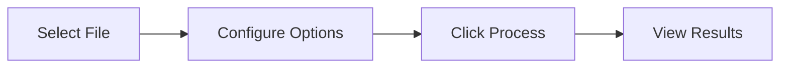
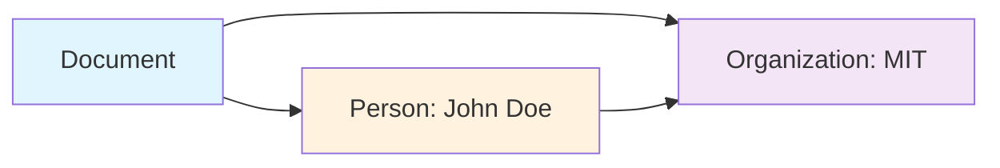

# User Guide

## Table of Contents

1. [Getting Started](#getting-started)
2. [Installation](#installation)
3. [Configuration](#configuration)
4. [Using the Application](#using-the-application)
5. [Processing Documents](#processing-documents)
6. [Understanding Results](#understanding-results)
7. [Troubleshooting](#troubleshooting)
8. [Best Practices](#best-practices)

## Getting Started

### Prerequisites

- **Operating System:** Linux, macOS, or Windows (with WSL)
- **Python:** 3.10 or higher
- **Ollama:** Latest version
- **Disk Space:** At least 10GB free
- **RAM:** Minimum 8GB (16GB recommended)

### Quick Start

```bash
# 1. Clone or download the application
cd docling-graph-showcase

# 2. Install Ollama
curl -fsSL https://ollama.com/install.sh | sh

# 3. Pull Granite model
ollama pull granite3.1:8b

# 4. Launch the application
./scripts/launch.sh

# 5. Open browser
# Navigate to http://localhost:7860
```

## Installation

### Method 1: Automated Script (Recommended)

```bash
# Make scripts executable
chmod +x scripts/*.sh

# Launch application (installs dependencies automatically)
./scripts/launch.sh
```

The launch script will:
- Create a virtual environment
- Install Python dependencies
- Check Ollama installation
- Pull required models
- Start the application

### Method 2: Manual Installation

```bash
# Create virtual environment
python3 -m venv venv
source venv/bin/activate  # On Windows: venv\Scripts\activate

# Install dependencies
pip install -r requirements.txt

# Install Ollama
curl -fsSL https://ollama.com/install.sh | sh

# Pull model
ollama pull granite3.1:8b

# Start Ollama service
ollama serve &

# Run application
python app.py
```

### Method 3: Docker

```bash
# Build image
docker build -t docling-graph-app .

# Run container
docker run -p 7860:7860 \
  -v $(pwd)/input:/app/input \
  -v $(pwd)/output:/app/output \
  -e OLLAMA_BASE_URL=http://host.docker.internal:11434 \
  docling-graph-app
```

### Method 4: Kubernetes

```bash
# Apply manifests
kubectl apply -f k8s/pvc.yaml
kubectl apply -f k8s/configmap.yaml
kubectl apply -f k8s/deployment.yaml
kubectl apply -f k8s/service.yaml

# Check status
kubectl get pods -l app=docling-graph

# Get service URL
kubectl get service docling-graph-service
```

## Configuration

### Environment Variables

Create a `.env` file in the project root:

```bash
# Ollama Configuration
OLLAMA_BASE_URL=http://localhost:11434
OLLAMA_MODEL=granite3.1:8b

# API Keys (optional, for remote providers)
MISTRAL_API_KEY=your_key_here
OPENAI_API_KEY=your_key_here
GEMINI_API_KEY=your_key_here

# Application Settings
GRADIO_SERVER_PORT=7860
GRADIO_SERVER_NAME=0.0.0.0
```

### Ollama Models

Available models for local inference:

```bash
# List installed models
ollama list

# Pull additional models
ollama pull llama3.1:8b
ollama pull mistral:7b
ollama pull codellama:13b

# Remove unused models
ollama rm model_name
```

### Template Configuration

Templates define the extraction schema. Located in `_samples/`:

```python
# _samples/simple_template.py
from pydantic import BaseModel, Field

class SimpleDocument(BaseModel):
    """Your custom template"""
    title: str = Field(description="Document title")
    # Add more fields...
```

## Using the Application

### Interface Overview

The application has three main tabs:

1. **📄 Individual Processing** - Process single documents
2. **📚 Batch Processing** - Process multiple documents
3. **ℹ️ Help** - Documentation and troubleshooting

### Individual Processing



**Steps:**

1. **Select Document**
   - Click "Select Document" dropdown
   - Choose a file from the input directory
   - Click "🔄 Refresh" to update the list

2. **Configure Options**
   - **Backend:** Choose LLM (text) or VLM (vision)
   - **Processing Mode:** 
     - `one-to-one`: Separate output per page
     - `many-to-one`: Single merged output
   - **Chunking:** Enable for large documents
   - **Provider:** Select LLM provider (ollama recommended)
   - **Model:** Specify model name

3. **Process Document**
   - Click "🚀 Process Document"
   - Monitor progress bar
   - Wait for completion

4. **View Results**
   - Status message shows summary
   - Download generated files:
     - Graph HTML (interactive visualization)
     - Nodes CSV (extracted entities)
     - Edges CSV (relationships)

### Batch Processing

Process all documents in the input directory at once.

**Steps:**

1. **Configure Options**
   - Set backend, mode, and provider
   - Same options as individual processing

2. **Start Batch**
   - Click "🚀 Process All Documents"
   - Progress updates for each file
   - Wait for completion

3. **Review Results**
   - Batch summary shows all processed files
   - Each file has its own output directory
   - Check `output/` for all results

## Processing Documents

### Supported Formats

- **PDF** - Multi-page documents
- **Images** - PNG, JPG, JPEG, TIFF
- **Markdown** - .md files
- **Office** - DOCX, PPTX, XLSX
- **HTML** - Web pages
- **Text** - Plain text files

### Adding Documents

```bash
# Copy files to input directory
cp /path/to/document.pdf input/

# Or use drag-and-drop in file manager
# Files must be in ./input/ directory
```

### Processing Options Explained

#### Backend Selection

**LLM (Large Language Model)**
- Best for: Text-heavy documents, PDFs, reports
- Processes: Extracted text from documents
- Speed: Fast
- Accuracy: High for text content

**VLM (Vision Language Model)**
- Best for: Images, forms, diagrams, complex layouts
- Processes: Visual content directly
- Speed: Slower
- Accuracy: Better for visual elements

#### Processing Modes

**One-to-One Mode**
```
Input: 3-page PDF
Output: 3 separate graphs (one per page)
Use case: When each page is independent
```

**Many-to-One Mode**
```
Input: 3-page PDF
Output: 1 merged graph (all pages combined)
Use case: When pages form a single document
```

#### Chunking

**Enabled (Recommended)**
- Splits large documents into chunks
- Respects LLM context limits
- Processes each chunk separately
- Merges results programmatically

**Disabled**
- Processes entire document at once
- May fail on large documents
- Faster for small documents

### Example Workflows

#### Workflow 1: Research Paper

```yaml
Document: research_paper.pdf (20 pages)
Backend: LLM
Mode: many-to-one
Chunking: Enabled
Provider: ollama
Model: granite3.1:8b

Result: Single knowledge graph with all entities and relationships
```

#### Workflow 2: Invoice Batch

```yaml
Documents: invoice_001.pdf, invoice_002.pdf, ...
Backend: VLM
Mode: one-to-one
Chunking: Disabled
Provider: ollama
Model: granite3.1:8b

Result: Separate graph for each invoice
```

#### Workflow 3: Technical Manual

```yaml
Document: manual.pdf (100 pages)
Backend: LLM
Mode: many-to-one
Chunking: Enabled
Provider: ollama
Model: granite3.1:8b

Result: Comprehensive graph of entire manual
```

## Understanding Results

### Output Structure

```
output/
└── run_20260221_153045/
    ├── summary_20260221_153045.md
    ├── graph.html
    ├── nodes.csv
    ├── edges.csv
    └── document.md
```

### File Descriptions

#### summary_TIMESTAMP.md

Processing summary with metadata:

```markdown
# Document Processing Summary

**File:** research_paper.pdf
**Timestamp:** 20260221_153045
**Backend:** llm
**Provider:** ollama
**Model:** granite3.1:8b

## Results
- **Nodes:** 45
- **Edges:** 38
- **Models Extracted:** 1
```

#### graph.html

Interactive visualization:
- Open in web browser
- Zoom and pan
- Click nodes for details
- Explore relationships

#### nodes.csv

Extracted entities:

```csv
id,label,type,properties
person_1,John Doe,Person,"{""role"": ""Author""}"
org_1,MIT,Organization,"{""type"": ""University""}"
```

#### edges.csv

Relationships:

```csv
source,target,type,properties
person_1,org_1,AFFILIATED_WITH,"{}"
```

#### document.md

Markdown version of the original document.

### Interpreting the Graph



**Node Types:**
- Entities (people, organizations, topics)
- Components (sections, measurements)

**Edge Types:**
- Relationships (authored_by, mentions, discusses)
- Hierarchical (has_section, contains)

### Metrics

**Graph Density:**
```
Density = Edges / (Nodes × (Nodes - 1))
Low density (< 0.1): Sparse connections
High density (> 0.5): Highly connected
```

**Node Degree:**
- In-degree: Incoming connections
- Out-degree: Outgoing connections
- High degree: Important/central nodes

## Troubleshooting

### Common Issues

#### 1. Application Won't Start

**Error:** `Port 7860 already in use`

**Solution:**
```bash
# Find process using port
lsof -i :7860

# Kill process
kill -9 <PID>

# Or use different port
export GRADIO_SERVER_PORT=7861
python app.py
```

#### 2. Ollama Connection Failed

**Error:** `Connection refused to localhost:11434`

**Solution:**
```bash
# Check if Ollama is running
curl http://localhost:11434/api/tags

# Start Ollama
ollama serve

# Check logs
tail -f ~/.ollama/logs/server.log
```

#### 3. Model Not Found

**Error:** `Model granite3.1:8b not found`

**Solution:**
```bash
# List available models
ollama list

# Pull required model
ollama pull granite3.1:8b

# Verify installation
ollama list | grep granite
```

#### 4. Out of Memory

**Error:** `CUDA out of memory` or `Killed`

**Solution:**
```bash
# Enable chunking in UI
# Or reduce model size
ollama pull granite3.1:2b

# Or increase system memory
# Or use remote API instead
```

#### 5. Processing Takes Too Long

**Solutions:**
- Enable chunking
- Use smaller model
- Reduce document size
- Use faster backend (LLM vs VLM)

#### 6. No Files in Dropdown

**Solution:**
```bash
# Check input directory
ls -la input/

# Add files
cp /path/to/file.pdf input/

# Refresh file list in UI
```

### Debug Mode

Enable detailed logging:

```bash
# Set environment variable
export DEBUG=1

# Run application
python app.py

# Check logs
tail -f logs/docling-graph-app.log
```

### Getting Help

1. **Check Logs**
   ```bash
   tail -f logs/docling-graph-app.log
   ```

2. **Verify Installation**
   ```bash
   python -c "import docling_graph; print(docling_graph.__version__)"
   ollama --version
   ```

3. **Test Ollama**
   ```bash
   curl http://localhost:11434/api/generate -d '{
     "model": "granite3.1:8b",
     "prompt": "Hello"
   }'
   ```

## Best Practices

### 1. Document Preparation

- **Clean PDFs:** Remove password protection
- **Optimize Size:** Compress large files
- **Consistent Format:** Use standard formats
- **Clear Text:** Ensure text is selectable

### 2. Template Selection

- **Start Simple:** Use basic templates first
- **Iterate:** Refine based on results
- **Domain-Specific:** Create custom templates
- **Validate:** Test with sample documents

### 3. Performance Optimization

- **Batch Similar Documents:** Process together
- **Use Appropriate Backend:** LLM for text, VLM for images
- **Enable Chunking:** For documents > 10 pages
- **Local Models:** Faster than API calls

### 4. Result Management

- **Organize Outputs:** Use descriptive names
- **Archive Old Results:** Move to archive directory
- **Version Control:** Track template changes
- **Backup Important Data:** Regular backups

### 5. Security

- **Sensitive Data:** Don't process confidential documents
- **API Keys:** Store in environment variables
- **Access Control:** Restrict input directory
- **Network Security:** Use HTTPS in production

### 6. Monitoring

- **Check Logs:** Regular log review
- **Monitor Resources:** CPU, memory, disk
- **Track Performance:** Processing times
- **Error Rates:** Failed processing attempts

## Advanced Usage

### Custom Templates

Create domain-specific templates:

```python
# _samples/custom_template.py
from pydantic import BaseModel, Field
from typing import List

def edge(label: str, **kwargs):
    return Field(..., json_schema_extra={"edge_label": label}, **kwargs)

class CustomEntity(BaseModel):
    model_config = {'is_entity': True}
    name: str
    # Add fields...

class CustomDocument(BaseModel):
    title: str
    entities: List[CustomEntity] = edge("HAS_ENTITY")
```

### API Integration

Use programmatically:

```python
from docling_graph import run_pipeline, PipelineConfig

config = PipelineConfig(
    source="document.pdf",
    template=CustomDocument,
    backend="llm",
    provider_override="ollama",
    model_override="granite3.1:8b"
)

context = run_pipeline(config)
graph = context.knowledge_graph
```

### Automation

Schedule batch processing:

```bash
# Cron job (daily at 2 AM)
0 2 * * * cd /path/to/app && ./scripts/batch-process.sh
```

## Next Steps

1. **Explore Examples:** Check `_samples/` directory
2. **Read Documentation:** See `Docs/` folder
3. **Join Community:** GitHub discussions
4. **Contribute:** Submit improvements

## Resources

- **Documentation:** `./Docs/`
- **Examples:** `./samples/`
- **Source Code:** `./app.py`
- **Scripts:** `./scripts/`
- **Docling-Graph:** https://github.com/docling-project/docling-graph
- **Ollama:** https://ollama.com